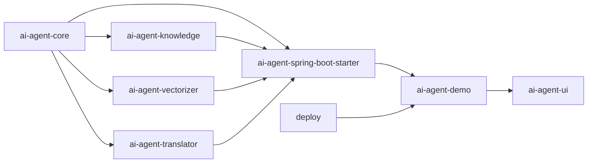

# AI Agent

一个可扩展的多模块 AI Agent 工程，支持会话编排、工具调用、知识增强（L0/L1/L2/L3 RAG）、向量化、字段翻译、SSE 前端交互与一键部署。

## 模块结构



## 核心能力

- 会话引擎：会话锁、记忆裁剪、澄清式对话、任务规划与执行追踪。
- 知识分层：L0 文本片段、L1 Schema 发现、L2 Safe SQL、L3 全量 RAG 引用上下文。
- 工具生态：`@AgentTool` 工具分组、装饰器拦截、超时/重试/并发限制。
- 部署体系：`deploy/install-all.sh` 支持 Linux 一键安装 Docker/Compose 并拉起服务。

## 环境要求

- Java 17+
- Maven 3.9+
- Node.js 18+
- Docker 24+（可由部署脚本自动安装）

## 快速开始

### 方式一：一键部署（Linux 推荐）

```bash
cd deploy
chmod +x install-all.sh
./install-all.sh
```

### 方式二：本地开发

```bash
# 1) 启动基础中间件
cd deploy
docker compose --env-file .env.example up -d mysql redis milvus

# 2) 启动后端
cd ../
mvn -pl ai-agent-demo -am spring-boot:run

# 3) 启动前端
cd ai-agent-ui
npm install
npm run dev
```

## 文档入口

- 项目文档：`docs/00-项目概述.md` 到 `docs/11-可观测与测试指南.md`
- 部署文档：`deploy/README.md`
- 模块文档：各子模块 `README.md`

## 许可证

仅用于学习与内部验证
