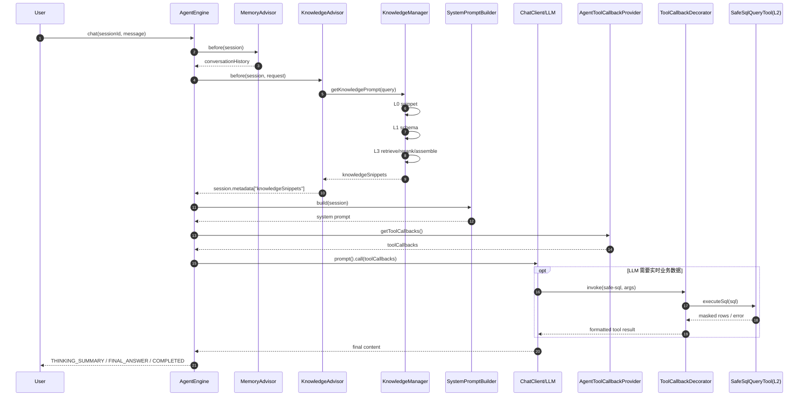

# 问题答疑：

## 目的

沉淀关于知识分层与 LLM 调用顺序的高频问题，统一团队认知，避免在联调和排障时出现理解偏差。

## 问题 1：如果 L0/L1/L2/L3 全都开启，当前代码中的执行顺序是什么？

### 简答

不是简单的 `L0 -> L1 -> L2 -> L3 -> LLM`。  
当前实现是：

1. 启动阶段先准备 L3 索引（基于 L0 片段切分）。
2. 每次请求先在 Advisor 链中组装 `L0 + L1 + L3` 到 Prompt 上下文。
3. 然后进入 LLM 主调用。
4. L2 作为工具，在 LLM 调用过程中按需触发执行（不是预先拼到 Prompt 里）。

### 代码级顺序（一次 chat 请求）

1. `AgentEngine.chat()` 获取会话并加锁。
2. `MemoryAdvisor.before()` 加载历史对话。
3. 按 `@Order` 执行 Advisor：
   - `KnowledgeAdvisor`（10）
   - `ClarificationAdvisor`（20）
   - `PlanningAdvisor`（30）
4. `KnowledgeAdvisor.before()` 调用 `KnowledgeManager.getKnowledgePrompt(query)`。
5. `KnowledgeManager` 内部组装顺序：
   - L0：`KnowledgeSnippetLoader` 加载片段
   - L1：`SchemaDiscoveryService + SchemaPromptGenerator`
   - L3：`RagRetriever -> RagReranker -> RagContextAssembler`
6. `SystemPromptBuilder.build(session)` 注入 `{knowledge_snippets}` 后，进入 `ChatClient.prompt().call()`。
7. LLM 运行中可通过 `toolCallbacks` 调用工具；若调用 `SafeSqlQueryTool`，即进入 L2 执行路径。
8. 请求结束后写回记忆并推送事件（`THINKING_SUMMARY`、`FINAL_ANSWER`、`COMPLETED`）。

### 代码级时序图



## 问题 2：LLM 在项目中起到了什么作用？

LLM 在当前项目中承担三类职责：

1. 语义理解与回答生成：理解用户问题并生成最终自然语言回答。
2. 工具决策与参数组织：在具备工具描述和上下文后，决定是否调用工具并组织入参。
3. 任务规划（可选链路）：`TaskPlanner` 中由 LLM 输出结构化 `TaskPlan`。

## 问题 3：为什么把 LLM 放到知识查询后面？

核心原因是 RAG/知识增强的一般范式：先准备证据，再让模型生成。

- 先注入 L0/L1/L3，可以给 LLM 明确事实依据，降低幻觉。
- 让模型基于业务上下文（术语、Schema、检索片段）做推理，而非凭参数记忆。
- 便于控制上下文边界和回答一致性。

> 注意：当前代码里“放在知识查询后面”主要指 L0/L1/L3。  
> L2 属于运行时工具能力，发生在 LLM 调用过程中，由模型按需触发。

## 问题 4：启动时出现 `OpenAiApi.embeddings` 的 `HTTP 404` 怎么办？

这是“Embedding 接口不可用或地址不匹配”的典型报错，常见于 OpenAI 兼容网关接入阶段。

### 常见原因

1. 运行在不支持 embedding 的 provider/profile（例如仅聊天能力）。
2. `base-url` 末尾多写了 `/v1`，客户端再次拼接后路径错误。
3. 环境变量覆盖了 yml（看起来改了配置，实际生效值没变）。
4. embedding 模型名不被当前服务商支持。

### 排查顺序（PowerShell）

```powershell
echo $env:SPRING_PROFILES_ACTIVE
echo $env:DASHSCOPE_BASE_URL
echo $env:DASHSCOPE_EMBEDDING_MODEL
```

确认启动日志中的 `Effective AI config => ...` 是否与预期一致（`baseUrl`、`embeddingModel`）。

### 修复建议

- DashScope 建议使用不带 `/v1` 的兼容根地址，并显式配置 embedding 模型。
- 若仅需聊天，不需向量能力，可关闭：
  - `ai.agent.knowledge.rag.enabled=false`
  - `ai.agent.vector.sync.enabled=false`

## 问题 5：为什么会报 `index not found[collection=...]`？

这是 Milvus 集合存在但没有可用索引时的报错，通常发生在“先检索、后建索引”的冷启动阶段。

### 处理方式

1. 确认 `initialize-schema: true`。
2. 启动后先执行一次向量同步（或等待启动后自动全量同步完成）。
3. 通过接口确认同步已执行：
   - `GET /api/agent/vector/status`
   - `POST /api/agent/vector/sync`
4. 若集合是历史脏数据，可删除旧集合后重建。

## 问题 6：为什么会报 `Incorrect dimension ... 1536 != 1024`？

根因是“当前 embedding 维度”和“已有 Milvus 集合字段维度”不一致。Milvus 集合字段维度创建后不可变。

### 处理方式

二选一：

1. **沿用旧集合维度**：把 embedding 模型和 `embedding-dimension` 改回旧值。
2. **升级到新维度（推荐）**：切换到新集合名（如 `ai_agent_knowledge_1536`），并设置对应维度。

### 推荐配置策略

- 将集合名和维度绑定管理，避免混用：
  - `ai_agent_knowledge_1024` ↔ `embedding-dimension=1024`
  - `ai_agent_knowledge_1536` ↔ `embedding-dimension=1536`
- 每次改 embedding 模型时，同步评估是否需要新建集合。

## 常见误区

- 误区 1：`L2` 也会和 L0/L1/L3 一样在 `KnowledgeManager` 中预先注入。  
  实际：不会，L2 是工具调用路径。
- 误区 2：全开后一定每次都走 L2。  
  实际：只有模型判断需要实时查询时才会调用。
- 误区 3：LLM 只负责“润色文案”。  
  实际：LLM 还负责工具选择、参数组织和（可选）任务规划。

## 参考代码位置

- `ai-agent-core/src/main/java/io/github/aiagent/core/agent/AgentEngine.java`
- `ai-agent-knowledge/src/main/java/io/github/aiagent/knowledge/KnowledgeAdvisor.java`
- `ai-agent-knowledge/src/main/java/io/github/aiagent/knowledge/KnowledgeManager.java`
- `ai-agent-knowledge/src/main/java/io/github/aiagent/knowledge/sql/SafeSqlQueryTool.java`
- `ai-agent-core/src/main/java/io/github/aiagent/core/prompt/SystemPromptBuilder.java`
- `ai-agent-knowledge/src/main/java/io/github/aiagent/knowledge/rag/RagFullIndexer.java`
